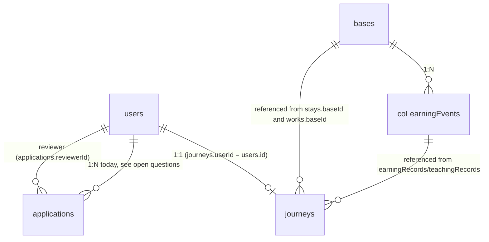

# Data schema (handoff for the backend dev)

This doc is the **source of truth for what the data should look like** when
this prototype gets a real database. It mirrors the TypeScript types in
[`lib/features/_shared/fake-db.ts`](../lib/features/_shared/fake-db.ts) and
the enums in [`lib/features/_shared/enums.ts`](../lib/features/_shared/enums.ts),
plus the read/write patterns observed in the feature repos under
`lib/features/<name>/repo.ts`.

Goal: a backend dev can read this doc once and produce a working
Postgres/MySQL migration. SQL types below are Postgres-flavoured; substitute
`text` → `varchar`, `jsonb` → `json`, `timestamptz` → `timestamp` for MySQL.

## Overview

There are five logical entities. In the current prototype each one is stored
as a single JSON document (a JSON file in dev, a Redis key in the demo
deploy). For a real DB they should become five top-level tables (with
optional child tables — see _Embedded vs normalized_).

- **`users`** — credentials and role. Owned by the auth feature; consumed
  everywhere a session is checked.
- **`applications`** — application-to-join records, each tied to one user.
  Includes payment + review state and the optional DID assignment. Owned by
  the `applications` feature; managed in the admin queue.
- **`journeys`** — a user's self-curated profile (the "我的旅程" page):
  bio, stays at bases, learning/teaching records pointing at co-learning
  events, original works, wishes-to-learn, and per-section visibility flags.
  1:1 with `users`.
- **`bases`** — physical locations the community partners with. Owned by the
  `bases` feature; admin-managed, public read.
- **`coLearningEvents`** — co-learning sessions hosted at a base. Owned by
  the `co-learning` feature; admin-managed, public read.

## Per-entity fields

For each field below: `tsField: tsType  →  suggested SQL type, nullability,
default — short description.`

### `users`

- `id: string  →  text PRIMARY KEY` — `nanoid(12)` today; for a real DB you
  could either keep nanoid (text PK) or switch to `uuid` and migrate ids.
- `phone: string?  →  text UNIQUE NULL` — E.164 (`+86…`). Demo seed uses
  `+8613800000001` etc.
- `email: string?  →  text UNIQUE NULL` — always lowercased before write
  (see [`lib/features/auth/repo.ts`](../lib/features/auth/repo.ts) `createUser`).
- `passwordHash: string  →  text NOT NULL` — bcrypt hash, cost 10.
- `role: 'user' | 'admin'  →  text NOT NULL CHECK (role in ('user','admin'))`
  — or a Postgres enum (see _Enums_).
- `createdAt: ISO string  →  timestamptz NOT NULL DEFAULT now()`.

Constraint: at least one of `phone` / `email` must be present (zod schema
already enforces this for input; add a DB-level `CHECK (phone IS NOT NULL
OR email IS NOT NULL)`).

### `applications`

- `id: string  →  text PRIMARY KEY` — `nanoid(10)`.
- `userId: string  →  text NOT NULL REFERENCES users(id) ON DELETE CASCADE`.
- `nickname: string  →  text NOT NULL` — currently treated as case-insensitive
  unique across all applications (see [`lib/features/applications/repo.ts`](../lib/features/applications/repo.ts)
  `createApplication`). Add `UNIQUE (lower(nickname))`.
- `selfIntro: string  →  text NOT NULL`.
- `interestTags: InterestTag[]  →  text[] NOT NULL DEFAULT '{}'` — every
  element must be in `INTEREST_TAGS`. Or normalize (see below).
- `portfolio: string?  →  text NULL` — URL.
- `paymentStatus: PaymentStatus  →  text NOT NULL CHECK (...)` — see _Enums_.
- `reviewStatus: ReviewStatus  →  text NOT NULL CHECK (...)`.
- `rejectReason: string?  →  text NULL` — populated when reviewStatus is one
  of the rejected variants.
- `submittedAt: ISO string  →  timestamptz NOT NULL DEFAULT now()`.
- `reviewedAt: ISO string?  →  timestamptz NULL`.
- `reviewerId: string?  →  text NULL REFERENCES users(id) ON DELETE SET NULL`.
- `didStatus: DidStatus?  →  text NULL CHECK (...)` — populated only after
  the application is approved.
- `didInfo: string?  →  text NULL` — opaque DID payload string.

Today's repo also enforces `ALREADY_APPLIED` (one application per user). If
you want to keep that, add `UNIQUE (userId)`. See _Open questions_.

### `journeys`

- `userId: string  →  text PRIMARY KEY REFERENCES users(id) ON DELETE CASCADE`
  — there is no separate `id` column; `userId` is the PK (1:1 with `users`).
- `avatarUrl: string  →  text NOT NULL` — defaulted from dicebear when blank.
- `displayName: string  →  text NOT NULL`.
- `bio: string  →  text NOT NULL DEFAULT ''`.
- `stays: Stay[]  →  jsonb NOT NULL DEFAULT '[]'` — see _Embedded vs normalized_.
- `learningRecords: { eventId }[]  →  jsonb NOT NULL DEFAULT '[]'`.
- `teachingRecords: { eventId, studentCount }[]  →  jsonb NOT NULL DEFAULT '[]'`.
- `works: Work[]  →  jsonb NOT NULL DEFAULT '[]'` — each work has its own
  `id` (`nanoid(10)` assigned in repo).
- `wishToLearn: Wish[]  →  jsonb NOT NULL DEFAULT '[]'`.
- `fieldVisibility: FieldVisibility  →  jsonb NOT NULL` — seven boolean flags
  controlling what shows on the public share page. Defaults all `true`.
- `updatedAt: ISO string  →  timestamptz NOT NULL DEFAULT now()` — bumped on
  every `upsertJourney` call.

### `bases`

- `id: string  →  text PRIMARY KEY` — `nanoid(10)` for new, fixed strings
  like `base_dali` / `base_anaya` / `base_dehang` for the seed.
- `emoji: string  →  text NOT NULL`.
- `name: string  →  text NOT NULL`.
- `province: CnProvince  →  text NOT NULL CHECK (...)`.
- `city: string  →  text NOT NULL` — free-form (e.g. "大理 · 沙溪古镇").
- `description: string  →  text NOT NULL`.
- `tags: BaseTag[]  →  text[] NOT NULL DEFAULT '{}'`.
- `localLife: { accommodations, coworking, tourism }  →  jsonb NOT NULL`
  — three sub-arrays, see _Embedded vs normalized_.
- `applyUrl: string  →  text NOT NULL`.
- `skillsOffered: SkillTag[]  →  text[] NOT NULL DEFAULT '{}'`.
- `skillsNeeded: SkillTag[]  →  text[] NOT NULL DEFAULT '{}'`.
- `localProjects: LocalProject[]  →  jsonb NOT NULL DEFAULT '[]'`.
- `timeline: TimelineEntry[]  →  jsonb NOT NULL DEFAULT '[]'`.
- `lat: number?  →  double precision NULL` — for the map view.
- `lng: number?  →  double precision NULL`.
- `createdAt: ISO string  →  timestamptz NOT NULL DEFAULT now()`.

### `coLearningEvents`

- `id: string  →  text PRIMARY KEY` — `nanoid(10)`.
- `name: string  →  text NOT NULL`.
- `instructorName: string  →  text NOT NULL`.
- `baseId: string  →  text NOT NULL REFERENCES bases(id) ON DELETE RESTRICT`.
- `skillTags: SkillTag[]  →  text[] NOT NULL DEFAULT '{}'`.
- `level: LevelTag  →  text NOT NULL CHECK (...)`.
- `period: { start, end }  →  jsonb NOT NULL` — both `YYYY-MM-DD` strings.
  Could also normalize to two `date` columns (`startDate`, `endDate`).

### Reusable shapes (used inside `jsonb` columns)

- **`DateRange`** — `{ start: 'YYYY-MM-DD', end: 'YYYY-MM-DD' }`. Consider
  splitting into two `date` columns when normalising.
- **`Stay`** — `{ baseId?: string, baseNameFree?: string, location: string,
  period: DateRange }`. Either `baseId` references a canonical base, or
  `baseNameFree` is filled in for off-grid locations.
- **`Work`** — `{ id, title, type: WorkType, baseId, period: DateRange,
  description, collaborators? }`.
- **`Wish`** — `{ skillName: string, category: WishCategory }`.
- **`FieldVisibility`** — seven booleans: `avatar, bio, stays, learning,
  teaching, works, wishToLearn`.
- **`LocalProject`** — `{ id, name, status: ProjectStatus, description,
  requiredSkills: SkillTag[], period: DateRange }`.
- **`TimelineEntry`** — `{ id, emoji, date: 'YYYY-MM-DD', title, description }`.

## Enums

All enums live in [`lib/features/_shared/enums.ts`](../lib/features/_shared/enums.ts)
as `as const` arrays. Adding a value is a one-line edit there; nothing else
to update. In SQL each can be either a Postgres `enum` type (strict, but
adding a value is a migration) or a plain `text` column with a `CHECK ... IN
(...)` constraint (looser, easier to evolve).

- **`ROLES`** — `'user' | 'admin'`
- **`INTEREST_TAGS`** — `数字游民, 可持续生活, 在地共创, 手作工艺, 摄影影像,
  写作出版, 户外探险, 教育共学, 身心疗愈, 文创设计, 技术开发, 音乐艺术`
- **`BASE_TAGS`** — `乡村, 店铺, 山林, 海岛, 古镇, 城市`
- **`SKILL_TAGS`** — `摄影, 写作, 插画, 陶艺, 木工, 编程, 设计, 瑜伽, 冥想,
  中医, 英语, 日语, 园艺, 烹饪, 音乐, 视频`
- **`WISH_CATEGORIES`** — `手工, 数字, 身心, 语言, 生活技能, 文创, CUSTOM`
  (the `CUSTOM` member is a sentinel for free-form skill names).
- **`WORK_TYPES`** — `PHOTO, ARTICLE, PRODUCT`
- **`LEVEL_TAGS`** — `EXPERIENCE, SERIES, MENTORSHIP`
- **`PROJECT_STATUS`** — `RECRUITING, IN_PROGRESS, FINISHED`
- **`PAYMENT_STATUS`** — `UNPAID, PAID, REFUND_PENDING, REFUNDED`
- **`REVIEW_STATUS`** — `PENDING, APPROVED, REJECTED_AWAITING_REFUND,
  REJECTED_REFUNDED`
- **`DID_STATUS`** — `PENDING_ASSIGN, ASSIGNED`
- **`CN_PROVINCES`** — abbreviated CN province list (33 values:
  `北京, 上海, 广东, 云南, ...`). See `enums.ts` for the full list. Likely
  worth keeping as `text CHECK` rather than a Postgres enum so it can be
  extended without a migration.

## Relationships & foreign keys

Explicit FKs:

- `applications.userId  →  users.id` — N:1; one user has at most one
  application in current code (see _Open questions_), but schema permits
  more.
- `applications.reviewerId  →  users.id` — N:1, NULL until reviewed.
- `journeys.userId  →  users.id` — 1:1 (PK).
- `coLearningEvents.baseId  →  bases.id` — N:1.
- _Inside `journeys.stays[].baseId` (jsonb)_ → `bases.id` — N:1, NULL
  permitted (then `baseNameFree` is set).
- _Inside `journeys.learningRecords[].eventId` (jsonb)_ → `coLearningEvents.id`.
- _Inside `journeys.teachingRecords[].eventId` (jsonb)_ → `coLearningEvents.id`.
- _Inside `journeys.works[].baseId` (jsonb)_ → `bases.id`.

If you keep nested arrays as `jsonb`, those four references can't be enforced
with FKs — they become app-level invariants. Promoting them to child tables
gives you real referential integrity (see next section).

## Embedded vs normalized

The prototype keeps a lot of related data inline as JSON. For each one,
here's the recommendation:

- **`Application.didStatus` / `Application.didInfo`** — keep on the row.
  These are 1:1 with the application and only set after approval.
- **`Application.interestTags`** — text array works. Normalise only if you
  need cross-application tag analytics.
- **`Journey.fieldVisibility`** — keep as `jsonb` (or 7 boolean columns).
  Always read/written as a single object.
- **`Journey.stays`** — recommend a child table `journey_stays(userId,
  baseId NULL, baseNameFree NULL, location, startDate, endDate)`. This lets
  the base detail page query "who has stayed here" cheaply, which is the
  most likely future read pattern.
- **`Journey.learningRecords` / `Journey.teachingRecords`** — recommend a
  single child table `journey_event_records(userId, eventId, kind ENUM
  ('learning','teaching'), studentCount NULL)`. Otherwise the per-event
  participation query needs to scan every journey jsonb.
- **`Journey.works`** — recommend a child table `works(id PK, userId,
  baseId, type, title, description, collaborators NULL, startDate, endDate)`.
  The base page already has a "produced works" view (see
  [`getProducedWorks`](../lib/features/bases/repo.ts)) that today scans all
  journeys; with a real table that's a single indexed query.
- **`Journey.wishToLearn`** — keep as `jsonb`; only ever read alongside the
  parent journey.
- **`Base.localLife`** (`{ accommodations, coworking, tourism }`) — keep as
  `jsonb`. Only the base detail page reads it, never queried into.
- **`Base.localProjects`** — recommend a child table `base_projects(id PK,
  baseId, name, status, description, requiredSkills text[], startDate,
  endDate)`. The "招募中项目" filter on the explorer is the obvious future
  query.
- **`Base.timeline`** — keep as `jsonb`. Display-only.
- **`CoLearningEvent.period`** — recommend two `date` columns instead of
  `jsonb`; date-range queries are common (e.g. "upcoming events").

If you want a one-shot first migration that's cheap to ship, `jsonb` for
all the above works fine. Promote to child tables as you discover queries
that need indexes.

## Indexes & uniqueness

Concrete index suggestions, derived from how the existing repos read:

- `users (phone) UNIQUE WHERE phone IS NOT NULL`
- `users (email) UNIQUE WHERE email IS NOT NULL`
- `applications (userId)` — drives "do I have an application?" lookup. Make
  it `UNIQUE` if the one-application-per-user invariant is permanent.
- `applications (reviewStatus, submittedAt DESC)` — drives the admin queue
  in [`getAllApplications`](../lib/features/applications/repo.ts).
- `applications (lower(nickname)) UNIQUE` — enforces the case-insensitive
  uniqueness already done in app code.
- `journeys (userId)` — already PK.
- `bases (province, city)` — drives the explorer's province filter.
- `bases (lower(name)) UNIQUE` — optional; today there is no DB-level
  uniqueness on base name.
- `coLearningEvents (baseId)` — drives the per-base events list.
- `coLearningEvents (period.start DESC)` (or `startDate DESC` if normalised)
  — drives the chronological event list in
  [`listEvents`](../lib/features/co-learning/repo.ts).

If you promote `journey.works` to a real table:

- `works (baseId)` — for the base detail "produced works" panel.
- `works (userId)` — for "this user's works" lookups.

## Repo → entity map

When a backend dev is ready to swap in real persistence, these are the only
files to rewrite — every other module talks to the data layer through them:

- [`lib/features/auth/repo.ts`](../lib/features/auth/repo.ts) → `users`
- [`lib/features/applications/repo.ts`](../lib/features/applications/repo.ts) → `applications`
- [`lib/features/journey/repo.ts`](../lib/features/journey/repo.ts) → `journeys` (and any future child tables)
- [`lib/features/bases/repo.ts`](../lib/features/bases/repo.ts) → `bases` (also reads `journeys` for `getProducedWorks`)
- [`lib/features/co-learning/repo.ts`](../lib/features/co-learning/repo.ts) → `coLearningEvents`

Plus the shared layer:

- [`lib/features/_shared/fake-db.ts`](../lib/features/_shared/fake-db.ts) — the three-function abstraction (`getTable`, `saveTable`, `updateTable`) that the repos call. You can either keep this abstraction as a thin wrapper over your ORM, or delete it entirely and have repos talk to the ORM directly (cleaner for SQL).
- [`lib/features/_shared/seed.ts`](../lib/features/_shared/seed.ts) — demo seed; port to a SQL seed script or one-off node script for staging.

## Migration recipe

1. Generate the initial schema migration using the per-entity sections above.
   Decide for each `jsonb` array whether to normalise now or later (defaults
   above are the conservative choice).
2. Port [`seedAll()`](../lib/features/_shared/seed.ts) into either a SQL
   seed file or a one-off Node script that uses the new ORM. Keep
   `seedIfEmpty()` semantics so dev/staging can wipe and reseed.
3. Reimplement the three functions in
   [`lib/features/_shared/fake-db.ts`](../lib/features/_shared/fake-db.ts)
   against the chosen client (Drizzle / Prisma / supabase-js / pg). Keep
   the public signatures and the `Schema` type — the feature repos will
   keep working unchanged. _(Or, cleaner long-term: delete `fake-db.ts` and
   rewrite each repo to use the ORM directly.)_
4. Drop the Redis dispatcher path and the `@upstash/redis` dependency.
5. Remove the `AUTO_SEED` flag and the `auto-seed.ts` helper. Real DBs get
   seeded out-of-band.
6. Set `AUTH_SECRET` (the demo deploy intentionally leaves it unset; see
   [`docs/deploy.md`](./deploy.md)).

## Open questions for product

Worth pinning down before you commit to SQL:

- **Is `Application` 1:1 or 1:N per user?** Today `createApplication` throws
  `ALREADY_APPLIED` if a user already has one. If users can re-apply after a
  rejection, drop that check and don't put a unique constraint on `userId`.
- **Should `bases.tags` be the strict `BASE_TAGS` set or free-form?** The
  TS type says strict; if curators want freer tagging, switch to plain
  `text[]` without a CHECK.
- **`Base.name` uniqueness?** Currently nothing enforces it. Easy to make
  `UNIQUE (lower(name))` if curators agree.
- **Append-only history?** `Journey.stays` and `Journey.works` are mutated
  in place today. If you want an audit trail (e.g. "Alice removed her 2024
  Anaya stay"), child tables with `createdAt`/`deletedAt` are the right shape.
- **Co-learning enrollment.** Today `learningRecords` lives inside the
  journey jsonb. If you ever need "list of attendees for event X", a real
  `event_attendances` table is essentially required.
- **DID payload shape.** `Application.didInfo` is currently a single string.
  When the real DID flow lands, this almost certainly becomes a structured
  `jsonb` (issuer, credential, signature, …) or a separate `dids` table.
